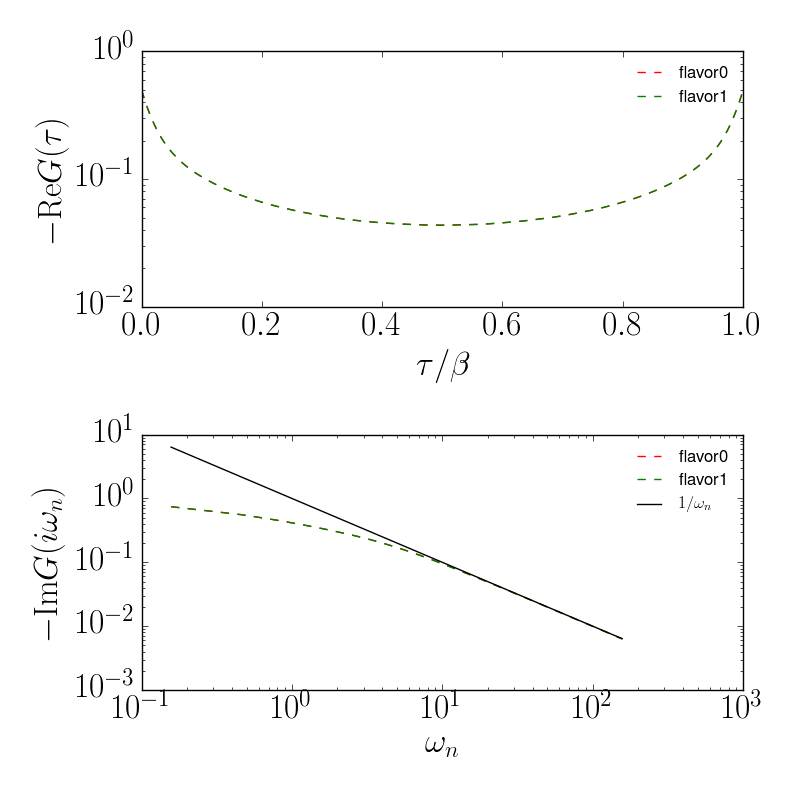
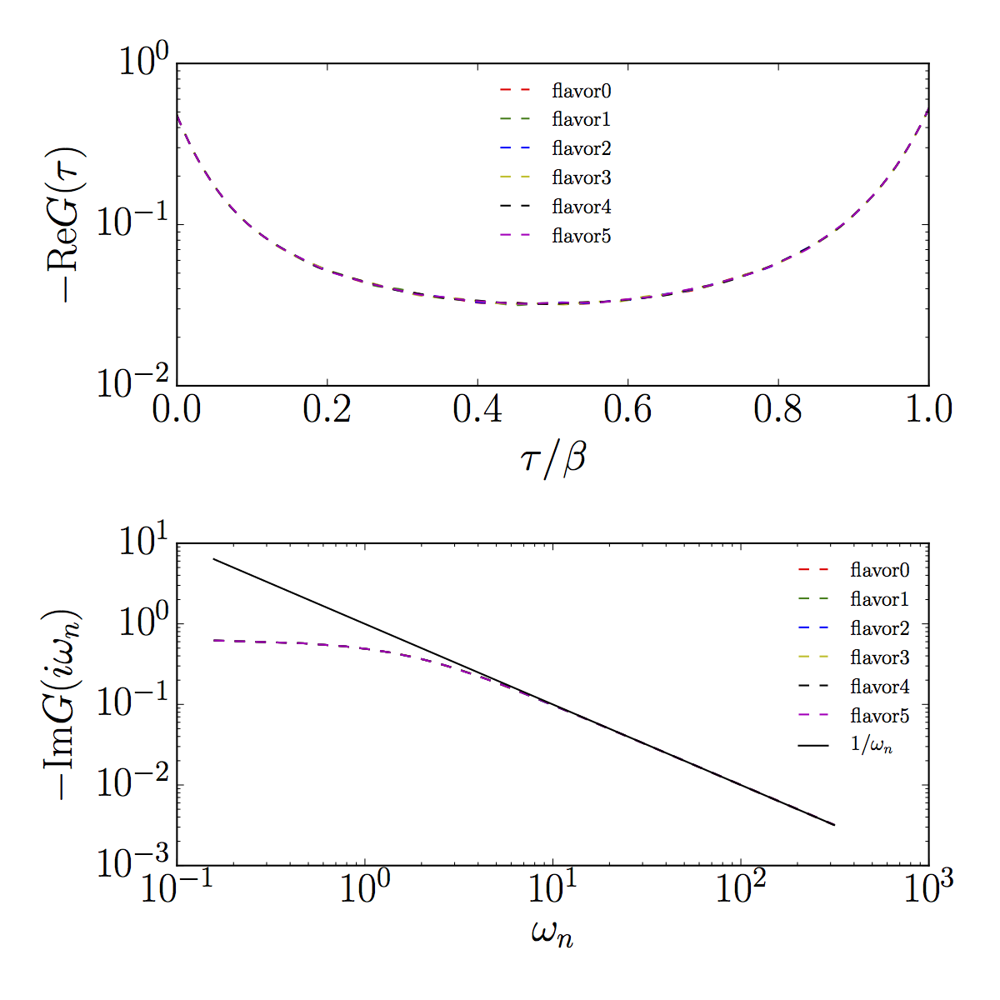

# List of tutorials
- [Tutorial0](#tutorial0)
- [Tutorial1](#tutorial1)

## Tutorial0
This is an example of an single-band Anderson impurity model.
$python mk_model.py                        #generate Coulomb matrix & hybridization function & generate hopping matrix
$mpirun -np 24 /path/to/hybmat input.ini   #run the solver with 24 MPI processes
$python plot.py                            #plot Green's function. The plot will be written into GF.eps.

At the end of the simulation, the results are written into the HDF5 file "input.out.h5".
A HDF5 file can be read easily e.g. by using the h5py library in Python.
In the script file "plot.py", one reads out the Green's function from the output file,
plot the data, and save the plot as a eps file.
Note that latex must be required to run plot.py.
If latex is not available on your cluster, please just download input.out.h5 to your local system and run plot.py.
The graph looks like this (simulation time was 5min with 24 MPI processes).



## Tutorial1
**We strongly recommend to run this tutorial at least with 24 MPI processes and 600 sec. Otherwise, the calculation will fail to converge.**
We explain how to solve a three-orbital model with spin-orbit coupling and Slater-Kanamori interaction.
The DOS of the bath is a semicircular of the width 4.
The hybridization function is diagonal in flavor.

The spin-orbit coupling is 1.
The matrix representation of the spin-orbit coupling is taken from Eq. (7) of Eur. Phys. J. B 86 (94) (2013).
We take U=1 and J=0.25 (U'=U-2J) for the Slater-Kanamori interaction.
The inverse temperature is 20.

Python scripts for generating input files and analyzing the result are available [here](https://github.com/ALPSCore/CT-HYB/tree/master/tutorials/tutorial1).
Checkout the files and provide something like the following:
```
$python gen_Uijkl.py                       #generate Coulomb matrix
$python gen_hyb.py                         #generate hybridization function
$python gen_hopping.py                     #generate hopping matrix
$mpirun -np 60 /path/to/hybmat input.ini   #run the solver with 60 MPI processes
$python plot.py                            #plot Green's function
```
If you want to use the non-MPI version, just do like this
```
$ /path/to/hybmat input.ini
```

At the end of the simulation, the results are written into the HDF5 file "input.out.h5".
A HDF5 file can be read easily e.g. by using the h5py library in Python.
In the script file "plot.py", one reads out the Green's function from the output file,
plot the data, and save the plot as a PDF file.
The graph looks like this (simulation time was 10min with 60 MPI processes).


## Tuto_gfy

This tutorial deals with a two-orbital model using density-density interaction.
The hybridization function is provided by an ad hoc file ec_delta.txt.
The hybridization function contains off-diagonal elements.

We take U=4.0 and J=0.25 * U. (U'=U-2J) for the density-density interaction following the application in PRL 116, 256403 (2016). The chemical potential is 1.1553024, the crystal field splitting is Delta = 3.4. The inverse temperature is 22. ec_delta corresponds to the case doping=1.6, ch=0.0

Python scripts for generating input files are available [here](https://github.com/ALPSCore/CT-HYB/tree/master/tutorials/tuto_gfy).
Checkout the files and provide something like the following:
```
$python gen_Uijkl.py                       #generate Coulomb matrix
$python gen_hopping.py                     #generate hopping matrix
$mpirun -np 60 /path/to/hybmat input.ini   #run the solver with 60 MPI processes
```
